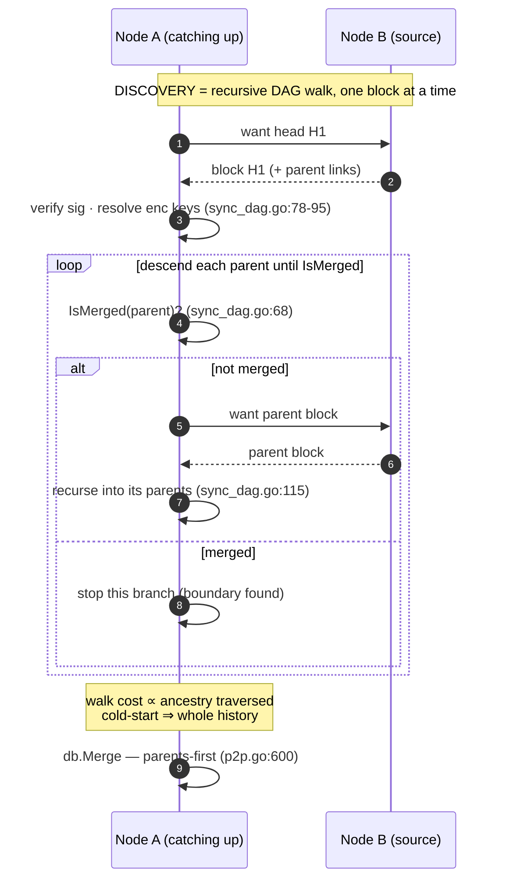
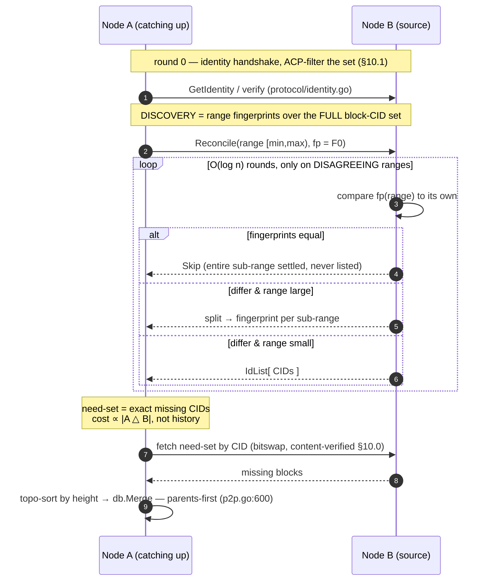

# RFC: Range-Based Set Reconciliation Sync (Negentropy)
- Status: Draft (feature-hunt spike) | Layer: CRDT/P2P | Date: 2026-06-25
- Effort estimate: **L** — full vision ~7-9 weeks; first useful slice (M0-M1) ~3-4 weeks. Confidence: **medium** (main unknowns: ACP-aware fingerprinting and auxiliary-index maintenance cost).

## 1. Summary

DefraDB peer sync is built on a Merkle-DAG of IPLD blocks identified by CID. Today, when a
node learns of a new head it walks the **entire DAG** of ancestors until it reaches blocks it has
already merged (`internal/db/p2p/sync_dag.go:36-130`). For incremental live updates this
short-circuits quickly, but for **cold-start catch-up**, **many-document/many-head divergence after a
partition**, and the **broadcast head-sync flows** (`sync_doc.go`, `sync_branchable_col.go`) the cost
is proportional to total history, not to the difference between two peers.

This RFC proposes an **additive anti-entropy protocol** based on **range-based set reconciliation
(Negentropy)**: peers recursively split a sorted range of block-CIDs, exchange associative
fingerprints, and descend only into ranges whose fingerprints disagree. Discovery of "what differs"
becomes `O(diff · log n)` in round-trips and bandwidth. Reconciliation is purely a **discovery
optimization**: once the missing-CID set is known, blocks are fetched and merged through the
**existing** `syncDAG` + `event.Merge` machinery, which already enforces parents-before-children
causal ordering. Pushlog/pubsub remain unchanged for low-latency live updates.

## 2. Motivation & use cases

The DAG walk is explicitly flagged as a known limitation (`internal/db/p2p/sync_dag.go:38-40`):

```go
// This process walks the entire DAG until the issue below is resolved.
// https://github.com/sourcenetwork/defradb/issues/2722
```

Three workloads expose the cost:

1. **Cold-start / large-history catch-up.** A fresh replica has *no* merged blocks, so the
   `IsMerged` short-circuit in `loadBlockLinks` (`sync_dag.go:68-74`) never fires early — it pulls the
   whole DAG. Bandwidth ∝ total history even if the replica only needs the tail.
2. **Many-document / many-head divergence after a partition.** The broadcast flows
   `SyncDocuments` (`sync_doc.go:61`) and `SyncBranchableCollection` (`sync_branchable_col.go:55`)
   ask every peer for **all** heads of the requested docs/collection (`processDocSyncItem`
   `sync_doc.go:307-336` enumerates every head via `headset.List`), then DAG-walk each head. Cost
   scales with the total head count and total ancestry, not with the divergent subset.
3. **Intermittent peers.** Peers that reconnect repeatedly re-exchange and re-walk overlapping
   history each time, because nothing tells them *where* they already agree.

Negentropy attacks the common factor: it makes the **discovery of the divergent subset** proportional
to the symmetric difference, so a catching-up peer learns exactly the CIDs it lacks without the
responder enumerating, and the requester walking, the entire shared history.

## 3. Current state (verified)

### 3.1 Full-DAG-walk sync (`internal/db/p2p/sync_dag.go`)
- `syncDAG(ctx, block)` (`sync_dag.go:41`) stores the head block, then calls
  `loadBlockLinks` (`sync_dag.go:56`).
- `loadBlockLinks` (`sync_dag.go:62`) computes the block link, then checks
  `bstore.IsMerged(ctx, link.Cid)` (`sync_dag.go:68`); if already merged it returns early
  (`sync_dag.go:72-74`) — this `IsMerged` check is the **only** stopping condition. Otherwise it
  verifies signatures (`sync_dag.go:78-86`), resolves any encryption keys (`sync_dag.go:88-95`), and
  recurses over `block.AllLinks()` (`sync_dag.go:97`), loading each linked block via
  `linkSys.Load` (`sync_dag.go:103`) and recursing (`sync_dag.go:115`). So it walks **all** parents
  until every branch hits a merged/known block.
- `IsMerged` is defined in `internal/datastore/blockstore.go:62-75`: a block is "merged" iff it is
  present **and** its to-merge index marker (`toMergeIndexPrefix = byte('m')`, `blockstore.go:51`)
  has been removed.

### 3.2 Pushlog (live push) — `protocol/pushlog.go`, `p2p.go`
- Wire types: `PushLogRequest{ MetaData; DocID; CID []byte; CollectionID; Creator; Block []byte }`
  and `PushLogReply{ MetaData }` (`protocol/pushlog.go:18-31`) — a single head + its block.
- Outbound: `SendUpdate` (`p2p.go:623`) pushes to replicators (`pushLogToReplicators`,
  `replicator.go:361`) and publishes the request to the docID topic (`p2p.go:643`) and collectionID
  topic (`p2p.go:648`).
- Inbound: `processPushlogRequest` (`p2p.go:540`) deduplicates via
  `Blockstore().IsMerged` (`p2p.go:567`), then calls `syncDAG` (`p2p.go:588`) and `db.Merge`
  (`p2p.go:600`). This is the path Negentropy will **reuse** for fetch + merge.

### 3.3 Replicator (gossip-push to defined peers) — `replicator.go`
- `pushHeadsForDoc` (`replicator.go:229`) loads a doc's heads via `getHeads` (`replicator.go:770`,
  which iterates the headstore by `HeadstoreDocKey` prefix) and sends one `PushLogRequest` per head
  through `p.replicatorProtocol.SendRequest` (`replicator.go:250`).
- `getHeads` (`replicator.go:770-822`) is a concrete example of enumerating a doc's heads + loading
  each head block — useful template for the reconciliation index source.

### 3.4 Broadcast head-sync flows — the closest existing analog to anti-entropy
- `sync_doc.go`: `SyncDocuments` (`sync_doc.go:61`) broadcasts `docSyncRequest{DocIDs}` on
  `docSyncTopic = "doc-sync"` (`sync_doc.go:37`); peers reply with **all** current heads per doc
  (`docSyncReply`/`docSyncItem`, `sync_doc.go:44-54`; `processDocSyncItem` `sync_doc.go:307`), and the
  requester DAG-fetches each head via `syncDocumentDAG → syncDAG` (`sync_doc.go:262-276`) then
  `db.Merge` (`sync_doc.go:258`).
- `sync_branchable_col.go`: same shape on `syncBranchableCollectionTopic = "sync-branchable"`
  (`sync_branchable_col.go:36`), replying with collection heads (`processSyncBranchableCollection`
  `sync_branchable_col.go:277`, keyed by `keys.NewHeadstoreColKey(shortID)` `sync_branchable_col.go:302`).
- `sync_col_versions.go`: `syncCollectionVersion` (`sync_col_versions.go:53`) recursively walks the
  collection-version block history.
- **Key observation:** these flows already implement "exchange heads → `syncDAG` → merge". The
  missing piece is that they exchange **every** head and then full-walk; they never compute the
  minimal set difference. Negentropy slots in exactly here.

### 3.5 libp2p stream / protocol registration — `internal/db/p2p/protocol/`
- Generic request/response channel: `NewCommChannel(host, name, processor)`
  (`protocol/comm_channel.go:61`) builds endpoints `protocolBase + name + protocolRequestSuffix` /
  `protocolResponseSuffix` and registers them with
  `h.SetStreamHandler(channel.requestEndpoint, channel.onRequest)` and `...onResponse`
  (`comm_channel.go:73-74`). Constants: `protocolBase = "/defradb/"`,
  `protocolRequestSuffix = "_req/" + protocolVersion`, `protocolVersion = "0.0.1"`
  (`comm_channel.go:22-27`). Pushlog registers as `"rep"` → `/defradb/rep_req/0.0.1` at `p2p.go:195`.
- `IdentityProtocol` (`protocol/identity.go:55-63`) is a second, hand-rolled example registering
  `/defradb/ident_req|resp/0.0.1` directly via `h.SetStreamHandler` (`identity.go:60-61`).
- Host interface: `SetStreamHandler(protocolID string, handler StreamHandler)`
  (`client/p2p.go:200`); `StreamHandler = func(stream io.Reader, peerID string)`
  (`client/p2p.go:143`); pubsub via `AddPubSubTopic(...)` (`client/p2p.go:205`).
- Message framing: CBOR-marshalled, signed, with a **16 MiB per-frame cap**
  (`maxMessageSize`, `message/message.go:37`, `Receive` `message.go:100-106`). Messages embed
  `MetaData` to inherit signing/verification (`message.go:43-81`, `signAndSetMetaData`
  `message.go:290`).

### 3.6 Heads & key namespacing
- `heads.List(ctx)` (`internal/core/block/heads.go:76`) iterates the headstore by prefix
  (`heads.go:78`) and returns `[]cid.Cid` **already sorted by CID bytes**
  (`heads.go:114-118`, `bytes.Compare(ci, cj) < 0`) plus the max CRDT height. This sort is exactly
  the total order Negentropy needs and can be reused directly.
- `HeadstoreDocKey{ DocID, FieldID, Cid }` serialises as `/d/[DocID]/[FieldID]/[Cid]`
  (`keys/headstore_doc.go:20-24,76-90`); composite DAG uses `FieldID = COMPOSITE_NAMESPACE = "C"`
  (`internal/core/type.go:14`, used at `sync_doc.go:308-311`).
- Store namespaces: `headStoreKey = byte('h')`, `blockStoreKey = byte('b')`
  (`internal/datastore/multi.go:31-32`). `Headstore()` returns
  `namespace.Wrap(rootstore, []byte{'h'})` (`multi.go:52,71`); `BlockstoreFrom` wraps `{'b'}`
  (`multi.go:99-111`).
- Blockstore iteration: `Blockstore` embeds `ipfsBlockstore.Blockstore`
  (`internal/datastore/blockstore.go:25-26`), which exposes
  `AllKeysChan(ctx) (<-chan cid.Cid, error)` (corekv `blockstore@v0.3.1/blockstore.go:135`). **But**
  this returns **all** CIDs globally, content-addressed, **not grouped by doc/collection** — see §5.

## 4. Proposed design

### 4.1 Algorithm — Negentropy

Negentropy (hoytech; as used by Nostr relays) reconciles two sets of fixed-shape items identified by
an ID, given a **total order** over IDs and an **associative, commutative fingerprint** over ranges.
The protocol is multi-round and the responder is stateless:

1. The **initiator** sends a small number of ranges covering the whole keyspace, each carrying a
   fingerprint of the items it holds in that range.
2. The **responder** compares each incoming range's fingerprint to its own. If they match, the range
   is settled (skip). If they differ and the range is small, it answers with an explicit **id-list**
   (so the peer learns exactly which IDs it is missing / has extra). If they differ and the range is
   large, it **splits** the range into sub-ranges and replies with a fingerprint per sub-range.
3. Repeat until all ranges are settled. Each round at least halves (configurable branching factor)
   the size of every still-disagreeing range, so the session converges in `O(log n)` rounds and the
   total data exchanged is `O(diff · log n)` — independent of the size of the agreed-upon majority.

At the leaves both sides know exactly which IDs the other lacks, yielding a **have-set** and a
**need-set** of CIDs.

### 4.2 What is the reconciled set?

**Items = block CIDs.** The reconciled set is scoped:

- **Per-document (MVP, Slice 1):** the set keyed by `HeadstoreDocKey{DocID, FieldID:"C"}` —
  initially the document's **heads** (cheap, already enumerable via `heads.List`), later the full
  set of block-CIDs in the document's composite Merkle-CRDT DAG.
- **Per-collection (Slice 2):** the union of all documents' block-CIDs in a collection (matches the
  branchable-collection head scope `keys.NewHeadstoreColKey(shortID)`,
  `sync_branchable_col.go:302`). This is where the `O(diff)` win is largest — one session covers
  thousands of docs.

Honest trade-off on **heads vs full block-set**:
- Reconciling **heads only** is cheap (small set, no new index) and feeds straight into existing
  `syncDAG`, whose `IsMerged` short-circuit (`sync_dag.go:68`) then makes the per-head walk
  diff-proportional **when peers already share most ancestry**. It does **not** fix cold-start.
- Reconciling the **full block-CID set** gives true `O(diff)` cold-start (you fetch exactly the
  missing blocks) but requires an auxiliary ordered index (§5) and a direct fetch path.

We ship heads-first, then full-set.

### 4.3 Causal ordering vs a flat set (critical)

Set reconciliation is **order-agnostic**, but Merkle-CRDT merge requires **parents before children**.
We deliberately do **not** reimplement merge ordering. Reconciliation only **discovers** the
missing-CID set; the receiver then fetches and merges through the existing machinery:

- For **heads** reconciliation: hand each newly-discovered head to `syncDocumentDAG → syncDAG`
  (`sync_doc.go:262`, `sync_dag.go:41`). `loadBlockLinks` recurses parents and stops at `IsMerged`
  blocks, and `db.Merge` (`p2p.go:600`) applies them causally. Blocks already delivered by an earlier
  reconciliation round terminate the walk early, so the walk cost ≈ the diff.
- For **full block-set** reconciliation: fetch the missing blocks directly (via the same
  `linkSys.Load` / block-service session used in `loadBlockLinks`), **topologically order** them by
  CRDT height (the headstore stores per-head height; blocks carry their links), and feed them to
  `db.Merge` parent-first. Signature verification already happens in `loadBlockLinks`
  (`sync_dag.go:78-86`) and must be preserved on this path.

Net: **reconciliation = discovery; `syncDAG`/`Merge` = causal validation.** No new causal-ordering
code is introduced in the MVP.

### 4.4 Sort key & fingerprint

- **Total order.** Lexicographic over a sort key `sortKey = heightBE8 || cidBytes`, where
  `heightBE8` is the CRDT block height as 8-byte big-endian and `cidBytes` is the full CID. Ordering
  by height first makes reconciliation roughly follow causal layers (helpful for fetch ordering);
  appending the CID breaks height ties and guarantees a **total** order. The heads-only MVP can reuse
  the plain CID-byte order already produced by `heads.List` (`heads.go:114-118`).
- **Fingerprint.** Following the Negentropy spec, accumulate per-item hashes additively and fold in
  the count to resist cancellation:
  `fp(range) = Hash( ( Σ_{cid ∈ range} SHA256(cidBytes) ) mod 2^256  ||  uvarint(count) )`,
  truncated to 16 bytes. Addition mod 2^256 is **associative and commutative**, so fingerprints of
  adjacent ranges combine (`fp(A∪B)` derivable from partial sums), which is what lets the responder
  split ranges cheaply. (Plain XOR is a simpler associative alternative but is vulnerable to
  pairwise cancellation; the additive-with-count form is preferred and matches the reference spec.)

### 4.5 Protocol messages & integration

A **new libp2p stream protocol** registered exactly like pushlog/identity (§3.5), so it is opt-in and
old peers that never register it simply fall back to pushlog / head-broadcast.

- Endpoint: `/defradb/reconcile_req/0.0.1` and `/defradb/reconcile_resp/0.0.1`.
- Wire types (CBOR, embedding `message.MetaData` to inherit signing + the 16 MiB cap):

```
ReconcileMessage {
  MetaData
  Scope   { Kind: Doc|Collection; ID: string }   // docID or collection short-id
  Ranges  []Range
}
Range {
  UpperBound []byte        // exclusive sort-key upper bound of this range
  Mode       enum          // Skip | Fingerprint | IdList
  Fingerprint [16]byte     // when Mode == Fingerprint
  IDs        [][]byte      // when Mode == IdList (CID bytes)
}
```

A session is a sequence of `ReconcileMessage` exchanges over the request/response endpoints,
correlated by `MetaData.MessageID` (reuse `message.Send`/`Receive`, `message.go:151,93`). The
initiator opens with one full-range `Fingerprint`; each reply refines ranges (`Skip`/`Fingerprint`/
`IdList`) until all are `Skip`. Leaf `IdList`s yield the need-set.

**Initiation triggers** (all additive; pushlog/pubsub untouched):
- **On-connect / on-peer-join:** the existing `peerEventHandler` (`p2p.go:531`) already fires on
  `JOINED`/`LEFT` for pubsub topics — hook a reconciliation session here.
- **Manual API:** `ReconcileDocument(ctx, peerID, docID)` / `ReconcileCollection(ctx, peerID, colID)`
  on `P2P`, surfaced on `client.P2P`.
- **Periodic anti-entropy:** a configurable scheduler (Slice 3) iterates shared scopes.

### 4.1 Integration points

New code (additive; nothing removed):
- **`internal/db/p2p/negentropy/`** (new, pure, no net deps): sort-key, fingerprint accumulator,
  and the range-split state machine. Unit/property-testable in isolation. Mirrors the
  storage-agnostic shape of the hoytech reference.
- **`internal/db/p2p/protocol/reconcile.go`** (new): `ReconcileMessage`/`Range` types embedding
  `message.MetaData` (pattern: `protocol/pushlog.go:18-31`), and a `ReconcileProtocol` registering
  the stream handlers via `host.SetStreamHandler` (pattern: `protocol/identity.go:55-63`,
  `protocol/comm_channel.go:73-74`).
- **`internal/db/p2p/reconcile.go`** (new): session driver + inbound handler + the
  "need-set → fetch → merge" glue. Mirrors `sync_doc.go` structure.
- **Register** in `New` (`p2p.go:182-195`), next to
  `p.replicatorProtocol = protocol.NewCommChannel(host, "rep", ...)` (`p2p.go:195`).

Reused / touched:
- **Reconciled-set source — heads:** `coreblock.NewHeadSet(...).List` (`heads.go:33,76`; live call
  site `sync_doc.go:313-315`).
- **Reconciled-set source — full set + index (Slice 2):** a new ordered index written incrementally
  on commit/merge. Add a store namespace alongside `headStoreKey`/`blockStoreKey`
  (`internal/datastore/multi.go:31-32`) and an accessor like `Headstore()` (`multi.go:71`); write the
  index in the same path that persists/merges blocks (`db.Merge`, reached at `p2p.go:600`).
- **Fetch-in-DAG-order:** `p.syncDAG` (`sync_dag.go:41`) / `p.syncDocumentDAG` (`sync_doc.go:262`)
  and `p.db.Merge` (`p2p.go:600`). The `IsMerged` short-circuit (`sync_dag.go:68`,
  `blockstore.go:62`) is what makes the fetch diff-proportional.
- **Access control:** the existing per-peer `hasAccess` gate (`p2p.go:341`) must filter which CIDs
  enter a fingerprint/id-list for a requesting peer (see §6).

## 5. Alternatives considered

| Approach | Round-trips | Bandwidth | State needed | Verdict |
|---|---|---|---|---|
| **Bloom filter exchange** | 1-2 | `O(n)` (filter sized to the whole set) | none | Filter size scales with **total** set size and false-positive rate, not the diff; poor for large shared history. Rejected. |
| **IBLT / minisketch** | 1 | `O(d)` if `d` is **known/bounded** in advance | none | Bandwidth-optimal for small, *pre-estimated* diffs, but decode fails if the diff exceeds the budgeted cells, forcing a guess-and-retry loop. Fragile for unbounded cold-start. Possible future leaf-level optimization. |
| **Merkle Search Tree (MST)** | `O(log n)` | `O(diff · log n)` | a persistent balanced MST | Strong (used by atproto), but requires maintaining a deterministic content-addressed tree over the set — significant new persistent structure and rebalancing. Heavier than needed for an additive spike. |
| **Prolly tree** | `O(log n)` | `O(diff · log n)` | a persistent probabilistic B-tree | Excellent for diff + range queries (Dolt), but again a large new storage subsystem. Overkill for first slice. |
| **Negentropy (range-based)** | `O(log n)` | `O(diff · log n)` | only a **sorted, fingerprintable view** (derivable for heads; light index for full set) | **Recommended.** No persistent tree required — fingerprints computed over sorted KV ranges; responder is stateless; handles unbounded diffs gracefully; minimal new on-disk state; small, self-contained wire format that fits the existing CBOR/signed-message + `SetStreamHandler` plumbing. |

**Recommendation: Negentropy.** It hits the same `O(diff · log n)` target as MST/prolly trees but
with the least new persistent state and the simplest wire protocol, which matters for an additive
anti-entropy layer that must coexist with pushlog. IBLT/minisketch can later be slotted in **at the
leaves** (replace large id-lists with a sketch) if profiling shows leaf id-lists dominate.

## 6. Risks & open questions

1. **Causal ordering vs flat set.** Mitigated by design (§4.3): reconciliation discovers the set;
   `syncDAG` + `Merge` enforce order. Residual risk on the full-set fetch path — if blocks are
   inserted out of order, CRDT merge could reject/misvalidate. Mitigation: topological sort by height
   before `Merge`, or route through `loadBlockLinks`’ parent-first recursion.
2. **Auxiliary-index cost & consistency (full-set scope).** The blockstore is global and
   content-addressed (`blockstore.go:25-32`; `AllKeysChan` returns *all* CIDs, not per-scope), and the
   headstore stores only **heads**. So a per-scope ordered CID set **cannot** be derived cheaply and
   needs a new index (+1 KV write per block, ~40-70 bytes). It must be updated in the **same
   transaction** as block persistence or it will drift on crash. Mitigation: write under the merge
   txn; provide a derive-on-read / rebuild fallback. **Open question:** is the per-block write
   overhead acceptable, or should the index be a maintained Merkle/Fenwick tree for `O(log n)`
   fingerprints instead of `O(range)` scans?
3. **ACP-aware fingerprints (real subtlety).** `hasAccess` (`p2p.go:341`) gates block serving
   per-peer. A fingerprint that includes CIDs a peer cannot access would **leak set membership** via
   the fingerprint itself. Correct behaviour requires **per-peer** (per-access-scope) fingerprints,
   which defeats caching a single fingerprint per range. **Open question:** acceptable to scope
   reconciliation to public/unencrypted collections first, and gate access only at the fetch step?
4. **Protocol versioning / negotiation.** New `/defradb/reconcile_*/0.0.1` endpoint must be optional:
   peers that don’t register it return libp2p "protocol not supported" → fall back to pushlog /
   head-broadcast. Bump the version suffix for wire changes (matches `comm_channel.go:23`).
5. **Adversarial peers.** A peer can (a) lie about fingerprints to force many rounds (round-amplification
   DoS) or (b) advertise bogus CIDs. Mitigations: hard caps on rounds and ranges-per-message per
   session; the existing 16 MiB frame cap (`message.go:37`); content-addressed fetch makes block
   forgery impossible (CID mismatch is rejected) and signatures are verified (`sync_dag.go:78-86`);
   fingerprint lies only waste the liar’s own bandwidth and our (capped) round budget.
6. **Frame size for large leaves.** A leaf id-list for a huge diff can exceed 16 MiB. Negentropy
   bounds id-list size per range; we must split further so no single `ReconcileMessage` exceeds the
   cap.

## 7. Test plan (TDD-first)

Write the failing (red) tests first, confirm red, then implement to green.

1. **Unit — fingerprint algebra (red first).** Property test: `fp(A ∪ B)` equals the combination of
   `fp(A)` and `fp(B)` for disjoint adjacent ranges; `fp` is order-independent; empty-range identity.
   Sort-key determinism: `heightBE8 || cidBytes` is a strict total order. Location: new
   `internal/db/p2p/negentropy/*_test.go`. Pure, no network.
2. **Unit — reconciler convergence vs symmetric difference (red first).** On synthetic sorted ID
   sets with a known overlap, assert both sides converge to identical sets and that **bytes exchanged
   scale with `|A △ B|`**, not `|A ∪ B|` (instrument the in-memory transport with a byte counter).
   Sweep diff sizes 0, 1, k, n.
3. **Property test vs the naive oracle.** Generate two random Merkle-CRDT histories with controlled
   overlap; assert the reconciliation result set **equals** the set the current `syncDAG` full-walk
   would converge to (oracle = existing sync), and that transferred bytes ≪ total-history bytes when
   the diff is small. White-box, alongside `internal/db/p2p/p2p_test.go`.
4. **Integration — two divergent nodes converge with bandwidth ∝ diff.** Node A has N commits, node B
   has N−k; reconcile a doc, then a collection; assert convergence (identical heads) and, via an
   instrumented/counting Host, that bytes scale with k. Location:
   `tests/integration/net/sync/reconcile/` (next to existing
   `tests/integration/net/sync/{collection_version,branchable_collection}`), using the test-action
   framework (`tests/action/sync_*.go`, `tests/integration/net/...`).
5. **Adversarial / round-cap test.** A peer returning garbage fingerprints causes the session to
   terminate within the round cap without crashing or unbounded allocation; oversize id-list is
   rejected by the 16 MiB cap.

## 8. Rollout / milestones

- **M0 — Reconciler core (no network).** `internal/db/p2p/negentropy/`: sort-key, additive
  fingerprint, range-split state machine + unit/property tests (§7.1-7.3). ~1.5-2 wks.
- **M1 — Per-document heads reconciliation (MVP slice).** New `reconcile.go` +
  `protocol/reconcile.go`, registered in `New` (`p2p.go:195`); manual `ReconcileDocument(peerID,
  docID)` API; need-set fed into existing `syncDocumentDAG`/`Merge`; integration test (§7.4). Pushlog
  untouched. ~2 wks.
- **M2 — Per-collection full-block-set + auxiliary index.** New ordered index namespace
  (`multi.go:31-32`), incremental writes on merge, direct missing-block fetch + topo-merge; trigger
  on `peerEventHandler` connect (`p2p.go:531`). ~2-3 wks.
- **M3 — Scheduling & hardening.** Periodic anti-entropy scheduler (configurable interval),
  ACP-aware fingerprints, round/range caps, metrics. Optionally replace the broadcast head-sync in
  `sync_doc.go`/`sync_branchable_col.go` with reconciliation. ~1.5 wks.

## 9. Verification log

Claims below were confirmed by reading the referenced files at the cited lines:

- **Full-DAG-walk comment + issue.** `internal/db/p2p/sync_dag.go:38-40` —
  `// This process walks the entire DAG until the issue below is resolved.` /
  `// https://github.com/sourcenetwork/defradb/issues/2722`.
- **Walk mechanics + stop condition.** `sync_dag.go:41` (`syncDAG`), `:56` (`loadBlockLinks` call),
  `:62` (`loadBlockLinks`), `:68` (`IsMerged`), `:72-74` (early return when merged), `:97` (loop over
  `AllLinks`), `:103` (`linkSys.Load`), `:115` (recurse).
- **`IsMerged` semantics.** `internal/datastore/blockstore.go:62-75`; to-merge marker
  `toMergeIndexPrefix = byte('m')` at `:51`; `Blockstore` embeds `ipfsBlockstore.Blockstore`
  (`:25-26`) → `AllKeysChan` exists (corekv `blockstore@v0.3.1/blockstore.go:135`) but is global.
- **Pushlog wire types.** `internal/db/p2p/protocol/pushlog.go:18-31`.
- **Pushlog send/receive.** `p2p.go:623` (`SendUpdate`), `:643`/`:648` (publish to docID/collection
  topics), `:540` (`processPushlogRequest`), `:567` (`IsMerged` dedup), `:588` (`syncDAG`), `:600`
  (`db.Merge`); replicator registration `p2p.go:195`.
- **Replicator head push.** `replicator.go:229` (`pushHeadsForDoc`), `:250` (`SendRequest`), `:770`
  (`getHeads` enumerates headstore by `HeadstoreDocKey` prefix).
- **Broadcast head-sync flows.** `sync_doc.go:37` (`docSyncTopic`), `:61` (`SyncDocuments`),
  `:262-276` (`syncDocumentDAG → syncDAG`), `:307-336` (`processDocSyncItem` via `headset.List`);
  `sync_branchable_col.go:36` (topic), `:55` (`SyncBranchableCollection`), `:277` / `:302`
  (heads via `NewHeadstoreColKey`); `sync_col_versions.go:53` (recursive version walk).
- **Stream protocol registration pattern.** `protocol/comm_channel.go:22-27` (endpoint constants),
  `:61` (`NewCommChannel`), `:73-74` (`SetStreamHandler`); `protocol/identity.go:55-63` (hand-rolled
  registration `/defradb/ident_req|resp/0.0.1`); `client/p2p.go:143` (`StreamHandler`), `:200`
  (`SetStreamHandler`), `:205` (`AddPubSubTopic`).
- **Message framing / 16 MiB cap.** `message/message.go:37` (`maxMessageSize`), `:100-106`
  (`Receive` enforcement), `:151` (`Send`), `:290` (`signAndSetMetaData`).
- **Heads order = total order.** `internal/core/block/heads.go:33` (`NewHeadSet`), `:76` (`List`),
  `:114-118` (sort by `bytes.Compare`); `keys/headstore_doc.go:20-24,76-90` (`HeadstoreDocKey`
  format); `internal/core/type.go:14` (`COMPOSITE_NAMESPACE = "C"`).
- **Namespacing.** `internal/datastore/multi.go:31-32` (`headStoreKey='h'`, `blockStoreKey='b'`),
  `:52,71` (`Headstore()`), `:99-111` (`BlockstoreFrom`).
- **Peer-join trigger hook.** `p2p.go:531` (`peerEventHandler`); pubsub topic registration in `New`
  at `p2p.go:199-208`.

## 10. Review notes — ACP & adversarial peers (2026-06-25)

These notes capture a code-grounded review of the two areas §6 flags but does not design.
They are inputs to a future §6.3 (ACP) and §6.5 (adversarial) rewrite, not yet folded in.

### 10.0 Correction to §6.5 (content forgery)
The claim "content-addressed fetch makes block forgery impossible" is **correct**, but **not**
because of `sync_dag.go`. `linkSys.TrustedStorage = true` (`sync_dag.go:31`) only trusts the
**local** blockstore on read. Network fetches go through boxo bitswap + blockservice
(`go-p2p/peer.go:146-147`: `bitswap.New(...)`, `blockservice.New(...)`), which verifies received
bytes against the requested CID. So forged **content** is rejected at the exchange layer — the
adversarial risk is everything *around* the fetch, not the fetch itself.

### 10.1 ACP — the core problem: discovery-time leak
Today's access control gates at the **fetch** step: `hasAccess` (`p2p.go:341`) is wired as bitswap's
`PeerBlockRequestFilter` (`go-p2p/peer.go:146`). A peer may request any CID; we decide per-block
whether to serve it. Reconciliation moves the leak **earlier**: fingerprints and id-lists reveal set
membership **before any fetch**. An id-list ("you lack CID X") proves X exists; a range fingerprint
leaks count and enables probing. Naively built, reconciliation is a **free enumeration oracle** over
the block set — strictly worse than today, where an attacker must already know a CID to request it.

Grounded facts:
- **ACP is document-scoped; read = `DocumentReadPerm`** (`acp/types/types.go:42`). There is **no
  field-level** DAC. Composite-DAG blocks carry `block.Delta.GetDocID()`; `hasAccess` gates on that
  (`p2p.go:452`). The access boundary is the document.
- **This breaks the per-collection scope (§4.2, Slice 2).** A collection-level fingerprint unions
  CIDs across docs the peer can and cannot read; sharing it leaks membership of gated docs.
  Per-collection reconciliation is only sound over the **subset the requester may read** → the
  fingerprint becomes **per-identity**, defeating a single cached fingerprint per range. This is a
  **correctness constraint**, not the perf "open question" framed in §6.3.
- **Identity must be established at session start.** Reuse `IdentityProtocol.GetIdentity`
  (`protocol/identity.go:65-98`): a JWT bound to the requesting peer's ID as audience, verified via
  `VerifyAuthToken` (`p2p.go:433`). Run this **before emitting any fingerprint**, then filter the set
  through `CheckDocAccessWithIdentityFunc` for that identity. Unauthenticated peers get the public set.
- **Encryption is orthogonal to the leak.** Encrypted blocks' CIDs are already visible to keyless
  peers (only key *bytes* are gated, `kms/pubsub.go:520-528`). Reconciling encrypted-but-ACP-public
  data is fine (peer fetches, cannot decrypt — as today). The leak is purely **ACP-gated** docs.
- **Definition / signature / lens blocks are always served** (`p2p.go:346-373`) — unrestricted
  reconciliation of those is safe.

ACP recommendations:
1. Add an **identity handshake** as round 0; compute fingerprints over the per-identity authorized
   set, never a global one.
2. State an **invariant**: no fingerprint or id-list may include a CID the requesting identity lacks
   `DocumentReadPerm` on. Filter through ACP *before* the set enters the reconciler.
3. **Drop per-collection scope for ACP-gated collections**, or define it as "per-collection over the
   requester's readable doc subset." Per-document scope (Slice 1) is naturally ACP-aligned → keep it
   as the MVP.
4. **Use the replicator fast-path as the safe MVP.** `processPushlogRequest` skips access checks when
   `isReplicator` (configured replicators are mutually trusted, `p2p.go:575-586`). Enable full-set
   reconciliation **first between configured replicator pairs** and on **policy-free / public-read
   collections** — sidesteps per-peer-filtered fingerprints, and is exactly where the cold-start
   `O(diff)` win is largest.
5. Residual **side channel**: which ranges split, and session timing, leak coarse size info about the
   gated set even with filtering. Acceptable for v1 if scoped to the readable set; document it.

### 10.2 Adversarial peers — already solid vs. missing
Already solid:
- Messages are CBOR-signed; signature is **bound to the libp2p PeerID** (`peer.IDFromPublicKey` must
  equal `SenderID`, `message/message.go:268-270`). Sender authentication is real.
- 16 MiB frame cap enforced via `LimitReader` (`message.go:100-106`).
- Network content forgery rejected by bitswap (§10.0).

Missing / weaker than §6.5 assumes:
- **No timeouts.** `commChannel.onRequest` runs on `context.Background()` (`comm_channel.go:99`) — no
  per-request deadline. A multi-round session on this could be held open indefinitely.
- **No rate limiting, no per-peer concurrency caps, no connmgr/resource-manager config** anywhere in
  `internal/db/p2p`. Any connected peer can open unlimited streams. Reconciliation adds a more
  expensive, multi-round endpoint to this unprotected surface.
- **Block signatures are optional** (`sync_dag.go:78`: `if block.Signature != nil`). An attacker can
  serve unsigned-but-CID-valid junk; it can't forge a specific CID's content but fails only later at
  CRDT/schema merge.
- **Unbounded DAG fan-out on fetch.** `loadBlockLinks` recurses `AllLinks()` with no link-count bound
  (`sync_dag.go:97`, `block.go:177`). Reconciliation amplifies this — many discovered heads, each a
  potential fan-out bomb.

Attack → mitigation:
- **Round-amplification DoS** (deliberately-disagreeing fingerprints force endless splits) → hard cap
  rounds/session; **session deadline** (must add); cap ranges/message.
- **Bogus-CID flooding** (id-list advertises a huge "missing" set you then try to fetch) → cap id-list
  entries/range and total need-set/session; rate-limit fetches; peer-score/backoff peers that
  advertise CIDs they never deliver.
- **Membership enumeration** (the ACP attack) → only fingerprint the requester's authorized set
  (§10.1); without it, reconciliation is an enumeration oracle.
- **Stateful-server exhaustion** → keep the responder **stateless** (a pure function of the incoming
  message — a core Negentropy property; enforce it so a malicious initiator burns only its own capped
  round budget).
- **DAG fan-out bomb on discovered heads** → bound links/block, total blocks fetched/session, and
  height/depth on the `syncDAG` fetch path.
- **Sybil / swarm of sessions** → gate reconciliation to allowlisted peers / replicators in the MVP;
  configure libp2p connmgr + resource manager (currently unset); per-peer max concurrent sessions.

Hardening checklist (add to §6.5 / M3):
1. Session deadline + per-message processing timeout — fixes the `context.Background()` gap (a
   prerequisite, not a nice-to-have).
2. Caps: max rounds/session, ranges/message, id-list entries/range, total need-set/session,
   concurrent sessions/peer, blocks fetched/session, links/block on fetch.
3. Enforce stateless responder as a design invariant.
4. Require the verified-identity handshake (shared with §10.1).
5. Peer scoring/backoff for non-convergent fingerprints and undelivered advertised CIDs.
6. MVP trust-scoping (replicators / public collections) neutralizes Sybil enumeration for v1.

The §6.5 line "fingerprint lies only waste the liar's own bandwidth" holds **only if** rounds are
capped, the responder is stateless, and we never act on unverified data — make those explicit
preconditions, not an asserted conclusion.

### 10.3 Through-line
Reconciliation moves trust decisions **earlier** than today's fetch-time gate. Both access control
and abuse-resistance must act at **discovery** (the fingerprint/id-list exchange), not just at fetch.
Scoping the first slice to mutually-trusted replicators and public collections de-risks both at once.

## 11. How DAG state is built — today vs. with reconciliation

Both flows end at the **same** `db.Merge` and write the **same** state (blocks in the blockstore,
heads in the headstore, to-merge markers cleared). They differ **only in the discovery phase** — how a
catching-up node learns *which* blocks it is missing. Today discovery is a recursive DAG walk whose
cost scales with the ancestry traversed; reconciliation replaces it with a flat set-difference whose
cost scales with the symmetric difference `|A △ B|`.

A reference DAG for both figures — Node A (catching up) is missing the shaded tip region; it already
holds `b0..b2` and everything below:

```
            H1      H2        ← heads (frontier; the only thing the headstore stores)
            |  \   /
            b4   b3           ┐ region A is MISSING (the diff)
            |     |           ┘
   ─────────┼─────┼────────── (A already has everything below this line; IsMerged == true)
            b2    b1
             \   /
              b0  (genesis)
```

### 11.1 Figure 1 — Today: state built by walking the DAG

Discovery = recurse from each new head through `AllLinks()` until every branch hits an `IsMerged`
block (`sync_dag.go:62-119`). The walk **re-touches blocks A already has** at each branch tip just to
discover the boundary, and on cold-start (no merged blocks) it never short-circuits — cost ∝ total
history.



Companion view — what the walk touches (✦ = fetched, ◌ = visited only to find the IsMerged boundary):

```
   ✦H1   ✦H2          fetched (the actual diff)
    | \   /
   ✦b4  ✦b3           fetched
    |    |
   ◌b2  ◌b1   ← visited + IsMerged-probed though already held (wasted work)
     \  /
     ◌b0
```

State stores read/written: blockstore (`b`), headstore (`h`), to-merge marker (`m`). Discovery needs
**no extra index** — but pays by walking ancestry it already has.

### 11.2 Figure 2 — With reconciliation: state built by set-difference

Discovery = exchange range fingerprints over the **full per-scope block-CID set** (materialized in the
new auxiliary ordered index, §5). Matching fingerprints prune identical sub-ranges without listing
them; the leaves yield the **exact** missing-CID set. A fetches only those blocks, then topo-sorts and
merges through the **unchanged** machinery. The walk is gone from discovery; the DAG is re-imposed only
at merge time as a height sort (§4.3).



Companion view — discovery touches only the diff; the shared majority is dismissed by one fingerprint:

```
   sorted full-set view:  [ b0 b1 b2 | b3 b4 H1 H2 ]
                           └────┬────┘ └────┬──────┘
                          fp match → Skip   fp differs → split → IdList
                          (never enumerated) (yields exact need-set: b3,b4,H1,H2)
```

State stores read/written: same blockstore/headstore/marker writes as Figure 1, **plus** the new
ordered per-scope CID index (a store namespace alongside `headStoreKey`/`blockStoreKey`,
`multi.go:31-32`) written incrementally on merge. That index is the cost of dropping the walk: it
materializes the DAG's transitive closure as a flat, fingerprintable set so that "what differs"
becomes a set operation instead of a graph traversal.

### 11.3 Side-by-side

| | Figure 1 — today | Figure 2 — reconciliation |
|---|---|---|
| Discovery mechanism | recursive DAG walk from heads | range-fingerprint set-difference |
| Blocks touched in discovery | full ancestry to the IsMerged boundary | only the symmetric difference |
| Cost | ∝ history walked (cold-start = all) | ∝ `|A △ B|` · log n |
| Extra persistent state | none | auxiliary ordered per-scope CID index (§5) |
| Fetch | bitswap, content-verified | bitswap, content-verified (unchanged) |
| Merge | `db.Merge`, parents-first | `db.Merge`, parents-first (unchanged) |
| Causal ordering re-imposed at | the walk itself | a height topo-sort before merge (§4.3) |
